

# Стек и вызов функций

и сразу [ссылка](https://www.felixcloutier.com/x86/) на instruction reference

---

## Работа с памятью - 1

- `mov rax, [rip + global_var]`, здесь `[rip + global_var]` - memory operand
- А есть что попроще?
  - `[rdi]`
  - `[rdi + 8]`,
  - `[rdi + rcx]`
  - `[rdi + rcx*4]`
  - в общем виде: `[r1 + r2 * 1/2/4/8 + imm]`
  - `label` превращается компилятором в `[0x402008]`
  - `[rip + label]` - в `[rip + 0xe87]`

---

## Работа с памятью - 2

- `mov [mem], reg` записывает значение регистра в память
- `mov reg, [mem]` - читает данные из памяти и кладет в регистр
- `mov [mem], [mem]` сделать не получится
- а что насчет `mov [mem], imm`?

---

## Работа с памятью - 2

- `mov [mem], reg` записывает значение регистра в память
- `mov reg, [mem]` читает данные из памяти и кладет в регистр
- `mov [mem], [mem]` сделать не получится
- а что насчет `mov [mem], imm`?
  - нужно уточнить размер данных: `mov QWORD PTR [mem], imm`
  - `BYTE`, `WORD`, `DWORD`, `QWORD` - 1, 2, 4, 8 байт

---

### Стек

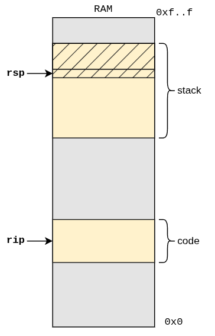

- `sub rsp, 16` - "объявление" двух переменных
- `mov [rsp], rax` - запись значения в переменную
- `lea rdi, [rsp+8]` - загрузка адреса переменной
- шорткаты:
  - `push rax` - положить значение регистра на стек
  - `pop rax` - снять голову со стека, положить значение в регистр

---

### Нулевое приближение

---

### call

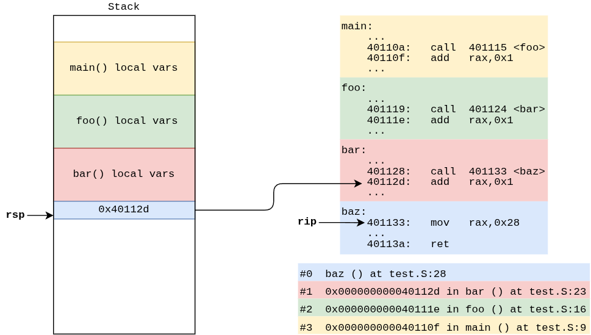

---

### ret-1

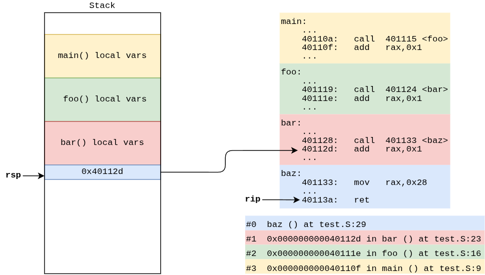

---

### ret-2

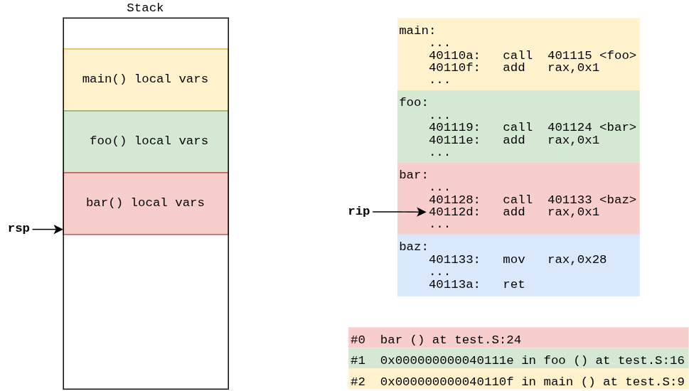

---

### Первое приближение

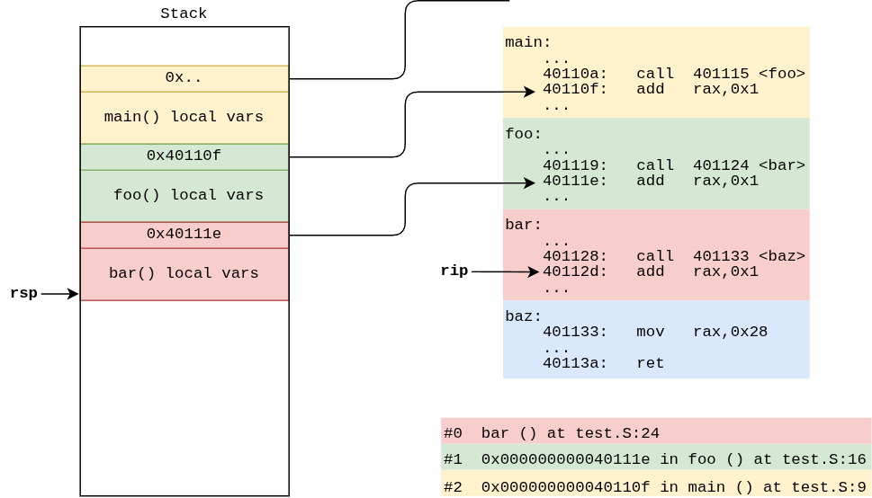

---

### Добавим rbp (base pointer)

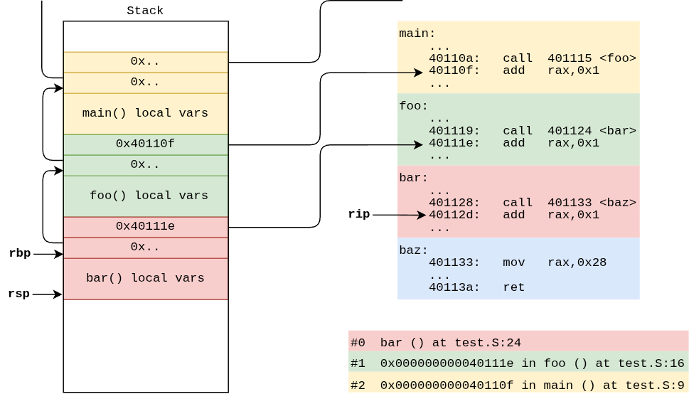

---

### Инвариант rbp - ?

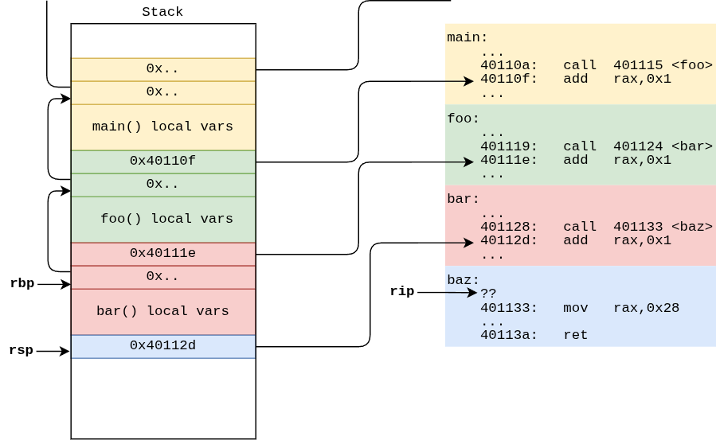

---

### Инвариант rbp - !

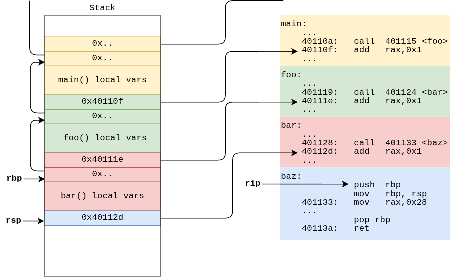

---

### Пролог - push

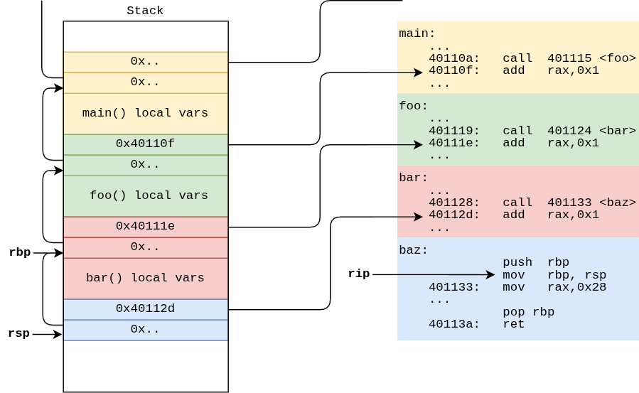

---

### Пролог - mov

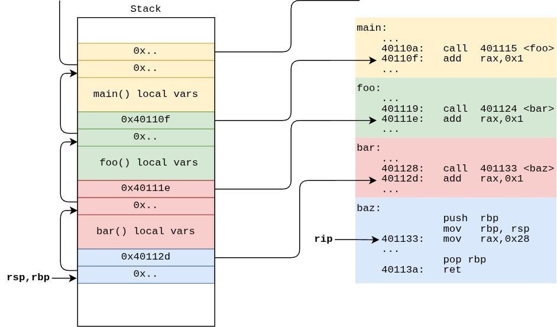

---

### Эпилог

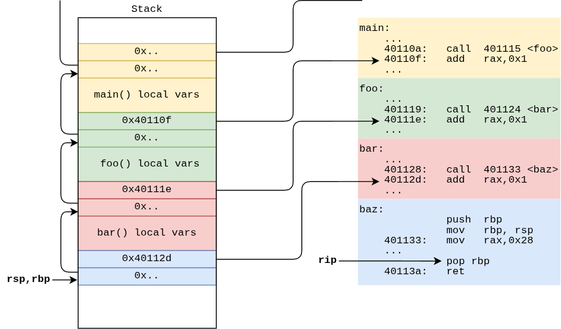

---

### Эпилог - pop

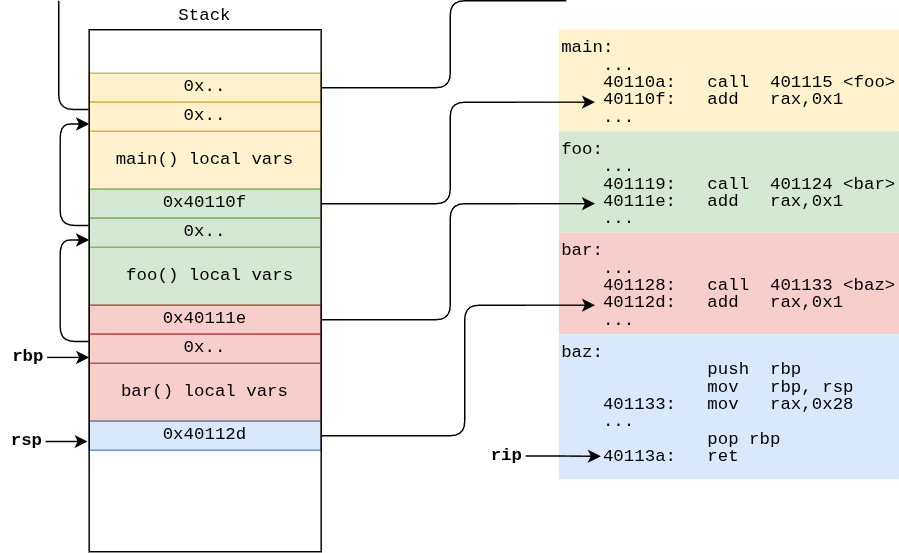

---

## Соглашение о вызовах (calling convention)

- Основное сейчас - System V AMD64 ABI (application binary interface)
- Аргументы - в `rdi`, `rsi`, `rdx`, `rcx`, `r8`, `r9` (остальные - на стеке)
- Возвращаемое значение - в `rax` (или в `rdx:rax`)
- 2 группы регистров. С точки зрения вызывающего:
  - Перед вызовом функции нужно сохранить значения для: **`rax`, `rdi`, `rsi`, `rdx`, `rcx`, `r8`, `r9`**, `r10`, `r11` (scratch, caller-saved)
  - Гарантируется, что не изменятся: `rbx`, **`rsp`**, **`rbp`**, `r12`, `r13`, `r14`, `r15` (preserved, callee-saved) 
- Перед вызовом `rsp` должен быть выровнен про 16 байтам